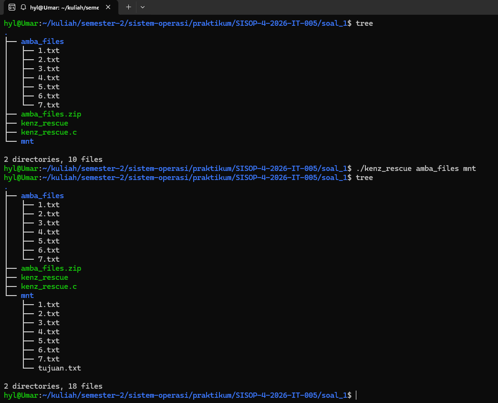
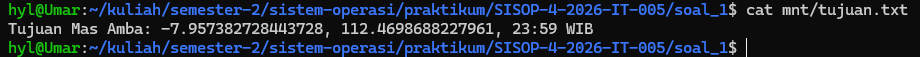
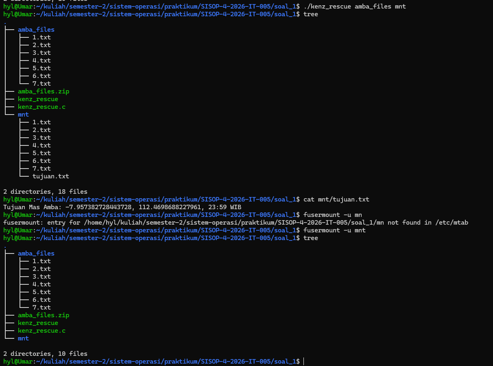
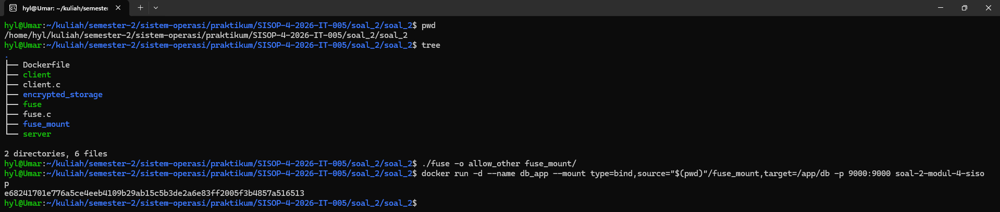
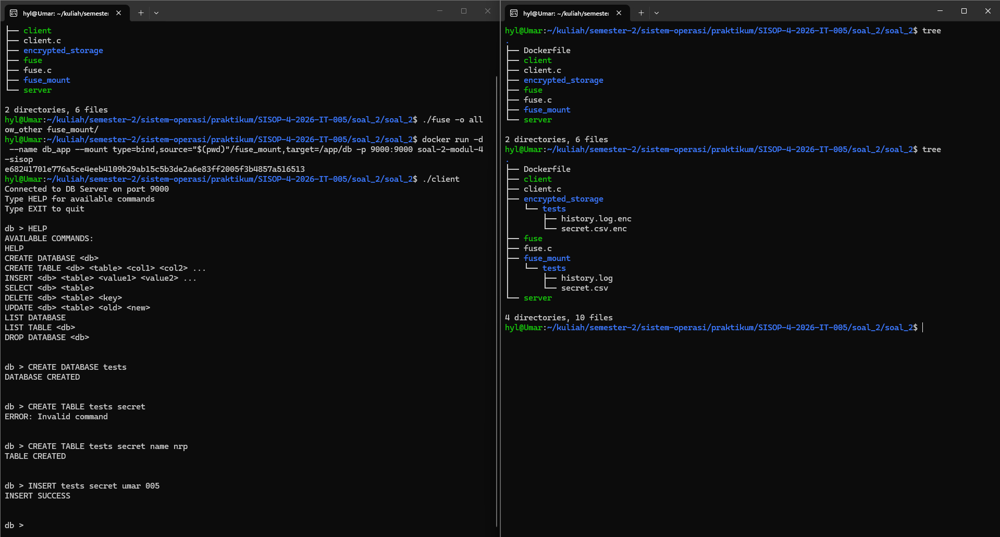
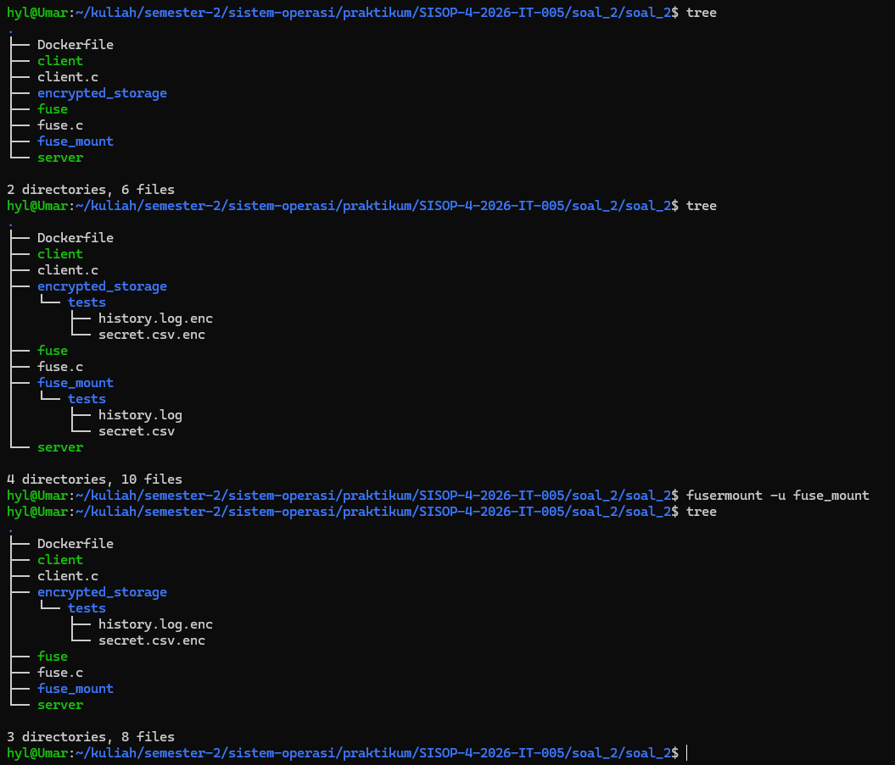

# SISOP-4-2026-IT-005

|               |           |
|---------------|-----------|
| Nama          | Umar      |
| NRP           | 5027251005|
| Kode Asisten  | KENZ      |

# Struktur Repositori:
```SISOP-4-2026-IT-005/
├── soal_1/
│   └── kenz_rescue.c
├── soal_2/
│   ├── Dockerfile
│   ├── client.c
│   ├── encrypted_storage/
│   ├── fuse.c
│   ├── fuse_mount/
│   └── server
├── soal_3/
│   └── ...
├── assets/
└── README.md
```

# Reporting

## Soal 1 - Save Asisten Kenz
Pada soal nomor 1 diminta untuk mengekstrak pecahan koordinat dari 7 file teks (dari `1.txt` sampai `7.txt`) yang ada di folder `amba_files`. Lalu menggabungkan pecahan-pecahan `KOOR` menjadi satu koordinat utuh yang benar, lalu menyimpannya ke dalam file `tujuan.txt` di folder `mnt`. Ini dilakukan menggunakan FUSE, sehingga file `tujuan.txt` tidak pernah benar-benar ada di disk.

1. `xmp_readdir`
```c
...
    if (strcmp(path, dirpath) == 0) { 
        filler(buf, "tujuan.txt", NULL, 0);
    }
...
```
Pada fungsi `xmp_readdir`, program memeriksa apakah path yang diminta adalah direktori root (`/`). Jika benar, maka program menggunakan fungsi `filler()` untuk menambahkan entri `tujuan.txt` ke dalam daftar file yang terlihat oleh pengguna saat mereka melihat isi direktori tersebut. Dengan cara ini, meskipun `tujuan.txt` tidak benar-benar ada di disk, pengguna tetap dapat melihatnya sebagai file yang tersedia.

2. `xmp_getattr`
```c
    if (strcmp(path, "/tujuan.txt") == 0) {
        stbuf->st_mode = S_IFREG | 0444; // Regular file, Read-Only
        stbuf->st_nlink = 1;
        
        char content[2048];
        get_koordinat_amba(content);
        stbuf->st_size = strlen(content);
        return 0;
    }
```
Logikanya, ketika ada permintaan atribut untuk `tujuan.txt`, program memanggil fungsi `get_koordinat_amba(content)` untuk mengisi variabel `content` dengan koordinat yang sudah digabungkan. Kemudian, ukuran file (`st_size`) diatur sesuai dengan panjang string `content`, sehingga ketika pengguna mencoba membaca `tujuan.txt`, mereka akan mendapatkan data yang benar-benar berisi koordinat yang sudah diproses.

3. `xmp_read`
```c
    if (strcmp(path, "/tujuan.txt") == 0) {
        char content[2048];
        get_koordinat_amba(content);
        
        size_t len = strlen(content);
        if (offset < len) {
            if (offset + size > len) size = len - offset;
            memcpy(buf, content + offset, size);
        } else {
            size = 0;
        }
        return size;
    }
```
Pada fungsi `xmp_read`, ketika pengguna mencoba membaca `tujuan.txt`, program kembali memanggil `get_koordinat_amba(content)` untuk memastikan bahwa data yang dibaca adalah koordinat yang sudah digabungkan. Program kemudian menghitung panjang konten dan menyalin bagian yang sesuai ke buffer `buf` berdasarkan offset dan ukuran yang diminta oleh pengguna. Jika offset melebihi panjang konten, maka ukuran yang dikembalikan adalah 0, menandakan bahwa tidak ada data lagi untuk dibaca.

4. `get_koordinat_amba`
```c
static void get_koordinat_amba(char *buffer) {
    strcpy(buffer, "Tujuan Mas Amba: ");
    
    for (int i = 1; i <= 7; i++) {
        char fpath[1000];
        sprintf(fpath, "%s/%d.txt", dirpath, i);
        
        FILE *f = fopen(fpath, "r");
        if (!f) continue;

        char line[256];
        while (fgets(line, sizeof(line), f)) {
            if (strncmp(line, "KOORD: ", 7) == 0) { // Cari baris awalan KOORD:
                line[strcspn(line, "\r\n")] = 0; // Hapus newline di akhir teks
                strcat(buffer, line + 7); // Gabungin teks setelah "KOORD: "
                break;
            }
        }
        fclose(f);
    }
    strcat(buffer, "\n");
}
```
Fungsi `get_koordinat_amba` bertugas untuk membaca setiap file teks dari `1.txt` hingga `7.txt` di dalam direktori `amba_files`. Program membuka setiap file, mencari baris yang diawali dengan "KOORD: ", lalu mengekstrak bagian koordinat setelah "KOORD: " dan menggabungkannya ke dalam `buffer`. Setelah semua file diproses, `buffer` akan berisi string lengkap yang menyatakan tujuan Mas Amba beserta koordinat yang sudah digabungkan.

5. Proof of Concept:

Run FUSE, lalu akses `tujuan.txt` untuk melihat hasilnya




## Soal 2 - Poke MOO

Pada soal nomor 2 diminta untuk menyelesaikan final project MOO berupa layanan mini database yang terisolasi dan aman. Program ini mengintegrasikan tiga buah konsep utama: File System in Userspace (FUSE), Containerization menggunakan Docker, dan komunikasi Client-Server melalui TCP Socket.

FUSE di sini tidak diimplementasikan sebagai pure passthrough, melainkan bertindak sebagai penerjemah (translator). File yang dibuat pada direktori `fuse_mount` akan dienkripsi secara otomatis dan disimpan di `encrypted_storage` dengan tambahan format `.enc`.

Berikut adalah bagian-bagian penyelesaian Soal 2:

1. **FUSE: Path dan Enkripsi**
Langkah pertama adalah membuat fungsi bantuan pada fuse.c agar proses perubahan nama file (path translasi) dan pengacakan isi file dapat dilakukan secara dinamis.

```c
static const char *dirpath = "/home/hyl/kuliah/semester-2/sistem-operasi/praktikum/SISOP-4-2026-IT-005/soal_2/soal_2/encrypted_storage";
static const char key = 0x76;

void xor_cipher(char *buf, size_t size) {
    for (size_t i = 0; i < size; i++) {
        buf[i] ^= key;
    }
}

void make_fpath(char *fpath, const char *path) {
    if (strcmp(path, "/") == 0) {
        sprintf(fpath, "%s", dirpath);
        return;
    }
    
    char temp[1024];
    sprintf(temp, "%s%s", dirpath, path);
    
    struct stat st;
    if (lstat(temp, &st) == 0 && S_ISDIR(st.st_mode)) {
        strcpy(fpath, temp); // Direktori tidak dienkripsi nama ekstensinya
    } else {
        sprintf(fpath, "%s%s.enc", dirpath, path); // File ditambahkan .enc
    }
}
```
Logikanya, program menggunakan fungsi `xor_cipher` untuk mengenkripsi dan mendekripsi data menggunakan operasi XOR dengan kunci `0x76`. Fungsi `make_fpath` bertugas merutekan ulang setiap request path dari `fuse_mount` menuju `encrypted_storage`. Terdapat validasi dengan `lstat()`, jika target merupakan direktori, namanya dibiarkan asli. Namun jika berupa file, namanya akan ditambahkan format `.enc`.

2. **FUSE: Operasi Read dan Write**
```c
static int xmp_read(const char *path, char *buf, size_t size, off_t offset, struct fuse_file_info *fi) {
    char fpath[1024];
    make_fpath(fpath, path);
    
    int fd = open(fpath, O_RDONLY);
    if (fd == -1) return -errno;

    int res = pread(fd, buf, size, offset);
    if (res == -1) res = -errno;
    else xor_cipher(buf, res); // Dekripsi saat membaca file

    close(fd);
    return res;
}

static int xmp_write(const char *path, const char *buf, size_t size, off_t offset, struct fuse_file_info *fi) {
    char fpath[1024];
    make_fpath(fpath, path);
    
    int fd = open(fpath, O_WRONLY);
    if (fd == -1) return -errno;

    char *enc_buf = malloc(size);
    memcpy(enc_buf, buf, size);
    xor_cipher(enc_buf, size); // Enkripsi sebelum menulis file

    int res = pwrite(fd, enc_buf, size, offset);
    if (res == -1) res = -errno;

    free(enc_buf);
    close(fd);
    return res;
}
```
Ketika ada instruksi penulisan (`xmp_write`), program mencegat data asli yang dikirim oleh pengguna, menyalinnya ke dalam `enc_buf`, lalu mengenkripsinya dengan `xor_cipher()` sebelum fungsi `pwrite()` menyimpannya secara fisik ke dalam memori perangkat. Sebaliknya, ketika pengguna melakukan pembacaan (`xmp_read`), program membaca data tersandi dari memori fisik lalu mengembalikannya ke bentuk semula (plaintext) dengan memanggil kembali `xor_cipher()`.

3. **Containerization Docker & Bind Mount**
Server dalam container menggunakan konfigurasi Dockerfile berikut:
```Dockerfile
FROM ubuntu:latest
WORKDIR /app
COPY ./server /app/server
RUN chmod +x /app/server
EXPOSE 9000
CMD ["./server"]
```
Menggunakan base image Ubuntu, seluruh kebutuhan program disalin ke dalam `/app`, lalu port 9000 diekspos agar socket dapat diakses oleh host.

Untuk mengintegrasikan server Docker ini dengan sistem file FUSE yang dibuat, kontainer harus dijalankan menggunakan opsi Bind Mount. Karena daemon Docker beroperasi menggunakan hak akses root, FUSE harus dieksekusi terlebih dahulu menggunakan izin opsi `allow_other`.
```bash
docker build -t soal-2-modul-4-sisop .
./fuse -o allow_other fuse_mount/
docker run -d --name db_app --mount type=bind,source="$(pwd)"/fuse_mount,target=/app/db -p 9000:9000 soal-2-modul-4-sisop
fusermount -u fuse_mount/ # unmount FUSE setelah selesai
```

4. **Client**
```c
    // ... inisialisasi socket ...
    if (connect(sock, (struct sockaddr *)&serv_addr, sizeof(serv_addr)) < 0) {
        printf("\nConnection Failed \n");
        return -1;
    }

    printf("Connected to DB Server on port 9000\n");

    while (1) {
        printf("\ndb > ");
        fgets(message, 1024, stdin);
        message[strcspn(message, "\n")] = 0;

        if (strcmp(message, "EXIT") == 0) break;

        send(sock, message, strlen(message), 0);
        
        memset(buffer, 0, sizeof(buffer));
        int valread = read(sock, buffer, 4096);
        if (valread > 0) printf("%s\n", buffer);
    }
```
Logikanya program client membuat koneksi ke localhost (`127.0.0.1`) pada port 9000 menggunakan metode `AF_INET` dan `SOCK_STREAM`. Melalui infinite loop `while(1)`, program secara terus-menerus meminta input query database pengguna, mengirimkannya ke server menggunakan `send()`, dan mencetak response menggunakan `read()`.

Ketika server merespon instruksi dengan membuat atau memperbarui tabel database di dalam `/app/db`, aktivitas ini akan langsung memicu mekanisme bind mount Docker yang tembus ke folder `fuse_mount` pada sistem host, yang selanjutnya langsung dienkripsi dan disimpan oleh FUSE ke dalam `encrypted_storage`.

5. Proof of Concept:

Run FUSE, jalankan Docker


Lakukan query database melalui client. Hasilnya, file database yang dibuat di dalam container akan muncul di `fuse_mount` dengan nama terenkripsi di `encrypted_storage`.


Unmount FUSE setelah selesai

