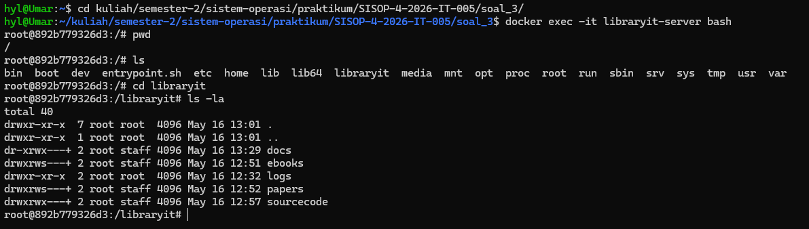
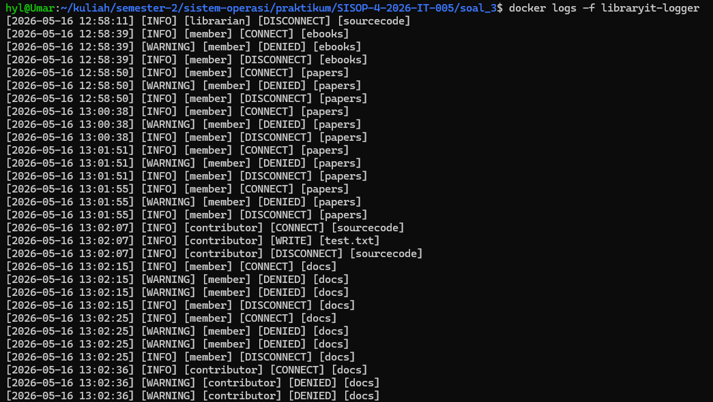
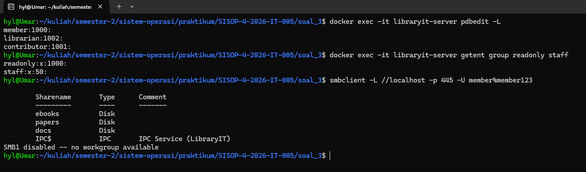
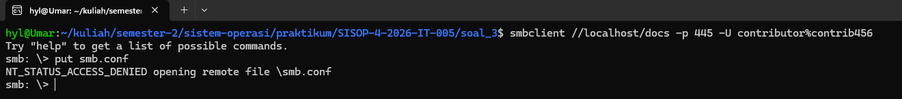
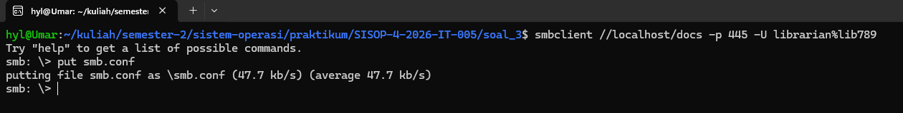

# SISOP-4-2026-IT-005

|               |           |
|---------------|-----------|
| Nama          | Umar      |
| NRP           | 5027251005|
| Kode Asisten  | KENZ      |

# Struktur Repositori:
```SISOP-4-2026-IT-005/
├── soal_1/
│   └── kenz_rescue.c
├── soal_2/
│   ├── Dockerfile
│   ├── client.c
│   ├── encrypted_storage/
│   ├── fuse.c
│   ├── fuse_mount/
│   └── server
├── soal_3/
│   ├── Dockerfile
│   ├── docker-compose.yml
│   ├── entrypoint.sh
│   ├── logs/
│   |   └── libraryit.log
|   └── data/
|       ├── docs/
|       ├── ebooks/
|       ├── papers/
|       └── sourcecode/
├── assets/
└── README.md
```

# Reporting

## Soal 1 - Save Asisten Kenz
Pada soal nomor 1 diminta untuk mengekstrak pecahan koordinat dari 7 file teks (dari `1.txt` sampai `7.txt`) yang ada di folder `amba_files`. Lalu menggabungkan pecahan-pecahan `KOOR` menjadi satu koordinat utuh yang benar, lalu menyimpannya ke dalam file `tujuan.txt` di folder `mnt`. Ini dilakukan menggunakan FUSE, sehingga file `tujuan.txt` tidak pernah benar-benar ada di disk.

### 1. `xmp_readdir`
```c
...
    if (strcmp(path, dirpath) == 0) { 
        filler(buf, "tujuan.txt", NULL, 0);
    }
...
```
Pada fungsi `xmp_readdir`, program memeriksa apakah path yang diminta adalah direktori root (`/`). Jika benar, maka program menggunakan fungsi `filler()` untuk menambahkan entri `tujuan.txt` ke dalam daftar file yang terlihat oleh pengguna saat mereka melihat isi direktori tersebut. Dengan cara ini, meskipun `tujuan.txt` tidak benar-benar ada di disk, pengguna tetap dapat melihatnya sebagai file yang tersedia.

### 2. `xmp_getattr`
```c
    if (strcmp(path, "/tujuan.txt") == 0) {
        stbuf->st_mode = S_IFREG | 0444; // Regular file, Read-Only
        stbuf->st_nlink = 1;
        
        char content[2048];
        get_koordinat_amba(content);
        stbuf->st_size = strlen(content);
        return 0;
    }
```
Logikanya, ketika ada permintaan atribut untuk `tujuan.txt`, program memanggil fungsi `get_koordinat_amba(content)` untuk mengisi variabel `content` dengan koordinat yang sudah digabungkan. Kemudian, ukuran file (`st_size`) diatur sesuai dengan panjang string `content`, sehingga ketika pengguna mencoba membaca `tujuan.txt`, mereka akan mendapatkan data yang benar-benar berisi koordinat yang sudah diproses.

### 3. `xmp_read`
```c
    if (strcmp(path, "/tujuan.txt") == 0) {
        char content[2048];
        get_koordinat_amba(content);
        
        size_t len = strlen(content);
        if (offset < len) {
            if (offset + size > len) size = len - offset;
            memcpy(buf, content + offset, size);
        } else {
            size = 0;
        }
        return size;
    }
```
Pada fungsi `xmp_read`, ketika pengguna mencoba membaca `tujuan.txt`, program kembali memanggil `get_koordinat_amba(content)` untuk memastikan bahwa data yang dibaca adalah koordinat yang sudah digabungkan. Program kemudian menghitung panjang konten dan menyalin bagian yang sesuai ke buffer `buf` berdasarkan offset dan ukuran yang diminta oleh pengguna. Jika offset melebihi panjang konten, maka ukuran yang dikembalikan adalah 0, menandakan bahwa tidak ada data lagi untuk dibaca.

### 4. `get_koordinat_amba`
```c
static void get_koordinat_amba(char *buffer) {
    strcpy(buffer, "Tujuan Mas Amba: ");
    
    for (int i = 1; i <= 7; i++) {
        char fpath[1000];
        sprintf(fpath, "%s/%d.txt", dirpath, i);
        
        FILE *f = fopen(fpath, "r");
        if (!f) continue;

        char line[256];
        while (fgets(line, sizeof(line), f)) {
            if (strncmp(line, "KOORD: ", 7) == 0) { // Cari baris awalan KOORD:
                line[strcspn(line, "\r\n")] = 0; // Hapus newline di akhir teks
                strcat(buffer, line + 7); // Gabungin teks setelah "KOORD: "
                break;
            }
        }
        fclose(f);
    }
    strcat(buffer, "\n");
}
```
Fungsi `get_koordinat_amba` bertugas untuk membaca setiap file teks dari `1.txt` hingga `7.txt` di dalam direktori `amba_files`. Program membuka setiap file, mencari baris yang diawali dengan "KOORD: ", lalu mengekstrak bagian koordinat setelah "KOORD: " dan menggabungkannya ke dalam `buffer`. Setelah semua file diproses, `buffer` akan berisi string lengkap yang menyatakan tujuan Mas Amba beserta koordinat yang sudah digabungkan.

### 5. **Proof of Concept & Screenshots** 

##### Run FUSE, lalu akses `tujuan.txt` untuk melihat hasilnya


## Soal 2 - Poke MOO

Pada soal nomor 2 diminta untuk menyelesaikan final project MOO berupa layanan mini database yang terisolasi dan aman. Program ini mengintegrasikan tiga buah konsep utama: File System in Userspace (FUSE), Containerization menggunakan Docker, dan komunikasi Client-Server melalui TCP Socket.

FUSE di sini tidak diimplementasikan sebagai pure passthrough, melainkan bertindak sebagai penerjemah (translator). File yang dibuat pada direktori `fuse_mount` akan dienkripsi secara otomatis dan disimpan di `encrypted_storage` dengan tambahan format `.enc`.

Berikut adalah bagian-bagian penyelesaian Soal 2:

### 1. **FUSE: Path dan Enkripsi**

Langkah pertama adalah membuat fungsi bantuan pada fuse.c agar proses perubahan nama file (path translasi) dan pengacakan isi file dapat dilakukan secara dinamis.

```c
static const char *dirpath = "/home/hyl/kuliah/semester-2/sistem-operasi/praktikum/SISOP-4-2026-IT-005/soal_2/soal_2/encrypted_storage";
static const char key = 0x76;

void xor_cipher(char *buf, size_t size) {
    for (size_t i = 0; i < size; i++) {
        buf[i] ^= key;
    }
}

void make_fpath(char *fpath, const char *path) {
    if (strcmp(path, "/") == 0) {
        sprintf(fpath, "%s", dirpath);
        return;
    }
    
    char temp[1024];
    sprintf(temp, "%s%s", dirpath, path);
    
    struct stat st;
    if (lstat(temp, &st) == 0 && S_ISDIR(st.st_mode)) {
        strcpy(fpath, temp); // Direktori tidak dienkripsi nama ekstensinya
    } else {
        sprintf(fpath, "%s%s.enc", dirpath, path); // File ditambahkan .enc
    }
}
```
Logikanya, program menggunakan fungsi `xor_cipher` untuk mengenkripsi dan mendekripsi data menggunakan operasi XOR dengan kunci `0x76`. Fungsi `make_fpath` bertugas merutekan ulang setiap request path dari `fuse_mount` menuju `encrypted_storage`. Terdapat validasi dengan `lstat()`, jika target merupakan direktori, namanya dibiarkan asli. Namun jika berupa file, namanya akan ditambahkan format `.enc`.

### 2. **FUSE: Operasi Read dan Write**
```c
static int xmp_read(const char *path, char *buf, size_t size, off_t offset, struct fuse_file_info *fi) {
    char fpath[1024];
    make_fpath(fpath, path);
    
    int fd = open(fpath, O_RDONLY);
    if (fd == -1) return -errno;

    int res = pread(fd, buf, size, offset);
    if (res == -1) res = -errno;
    else xor_cipher(buf, res); // Dekripsi saat membaca file

    close(fd);
    return res;
}

static int xmp_write(const char *path, const char *buf, size_t size, off_t offset, struct fuse_file_info *fi) {
    char fpath[1024];
    make_fpath(fpath, path);
    
    int fd = open(fpath, O_WRONLY);
    if (fd == -1) return -errno;

    char *enc_buf = malloc(size);
    memcpy(enc_buf, buf, size);
    xor_cipher(enc_buf, size); // Enkripsi sebelum menulis file

    int res = pwrite(fd, enc_buf, size, offset);
    if (res == -1) res = -errno;

    free(enc_buf);
    close(fd);
    return res;
}
```
Ketika ada instruksi penulisan (`xmp_write`), program mencegat data asli yang dikirim oleh pengguna, menyalinnya ke dalam `enc_buf`, lalu mengenkripsinya dengan `xor_cipher()` sebelum fungsi `pwrite()` menyimpannya secara fisik ke dalam memori perangkat. Sebaliknya, ketika pengguna melakukan pembacaan (`xmp_read`), program membaca data tersandi dari memori fisik lalu mengembalikannya ke bentuk semula (plaintext) dengan memanggil kembali `xor_cipher()`.

### 3. **Containerization Docker & Bind Mount**
Server dalam container menggunakan konfigurasi Dockerfile berikut:
```Dockerfile
FROM ubuntu:latest
WORKDIR /app
COPY ./server /app/server
RUN chmod +x /app/server
EXPOSE 9000
CMD ["./server"]
```
Menggunakan base image Ubuntu, seluruh kebutuhan program disalin ke dalam `/app`, lalu port 9000 diekspos agar socket dapat diakses oleh host.

Untuk mengintegrasikan server Docker ini dengan sistem file FUSE yang dibuat, kontainer harus dijalankan menggunakan opsi Bind Mount. Karena daemon Docker beroperasi menggunakan hak akses root, FUSE harus dieksekusi terlebih dahulu menggunakan izin opsi `allow_other`.
```bash
docker build -t soal-2-modul-4-sisop .
./fuse -o allow_other fuse_mount/
docker run -d --name db_app --mount type=bind,source="$(pwd)"/fuse_mount,target=/app/db -p 9000:9000 soal-2-modul-4-sisop
fusermount -u fuse_mount/ # unmount FUSE setelah selesai
```

### 4. **Client**
```c
    // ... inisialisasi socket ...
    if (connect(sock, (struct sockaddr *)&serv_addr, sizeof(serv_addr)) < 0) {
        printf("\nConnection Failed \n");
        return -1;
    }

    printf("Connected to DB Server on port 9000\n");

    while (1) {
        printf("\ndb > ");
        fgets(message, 1024, stdin);
        message[strcspn(message, "\n")] = 0;

        if (strcmp(message, "EXIT") == 0) break;

        send(sock, message, strlen(message), 0);
        
        memset(buffer, 0, sizeof(buffer));
        int valread = read(sock, buffer, 4096);
        if (valread > 0) printf("%s\n", buffer);
    }
```
Logikanya program client membuat koneksi ke localhost (`127.0.0.1`) pada port 9000 menggunakan metode `AF_INET` dan `SOCK_STREAM`. Melalui infinite loop `while(1)`, program secara terus-menerus meminta input query database pengguna, mengirimkannya ke server menggunakan `send()`, dan mencetak response menggunakan `read()`.

Ketika server merespon instruksi dengan membuat atau memperbarui tabel database di dalam `/app/db`, aktivitas ini akan langsung memicu mekanisme bind mount Docker yang tembus ke folder `fuse_mount` pada sistem host, yang selanjutnya langsung dienkripsi dan disimpan oleh FUSE ke dalam `encrypted_storage`.

### 5. **Proof of Concept & Screenshots**

#### Run FUSE, jalankan Docker


#### Query database melalui client. Hasilnya, file database yang dibuat di dalam container akan muncul di `fuse_mount` dengan nama terenkripsi di `encrypted_storage`.


#### Unmount FUSE setelah selesai


# Soal 3 - LibraryIT

Pada soal nomor 3 diminta untuk membuat sebuah sistem logging LibraryIT. Sistem ini harus mampu mencatat semua aktivitas pengguna, termasuk login, logout, pencarian buku, peminjaman, dan pengembalian buku. Log harus disimpan dalam format yang terstruktur dan mudah dianalisis.

Server Samba berjalan di dalam container docker dengan 4 ruang penyimpanan (ebooks, papers, sourcecode, docs) yang punya aturan akses berbeda, user/group otomatis, data persisten di host, serta logging aktivitas yang dapat dipantau real-time. Implementasi ada pada [Dockerfile](soal_3/Dockerfile), [docker-compose.yml](soal_3/docker-compose.yml), [smb.conf](soal_3/smb.conf), dan [entrypoint.sh](soal_3/entrypoint.sh).

## Ringkasan Konfigurasi

- Share yang tersedia: `ebooks`, `papers`, `sourcecode`, `docs` di `/libraryit`.
- User dan grup:
    - `member` (password `member123`) -> grup `readonly`.
    - `contributor` (password `contrib456`) -> grup `staff`.
    - `librarian` (password `lib789`) -> grup `staff` dan `docswriter`.
- Akses:
    - `ebooks` dan `papers`: `staff` read/write, `readonly` read-only.
    - `sourcecode`: hanya `staff`, tidak terlihat oleh `readonly`.
    - `docs`: semua bisa read, hanya `librarian` yang boleh write.
- Data koleksi dan log disimpan di host melalui bind-mount.
- Logging aktivitas menggunakan `vfs_full_audit` lalu diparsing jadi format sesuai soal.

## Struktur dan Alur Eksekusi

1. Docker Compose menjalankan service `libraryit-server` terlebih dahulu.
2. Container mengeksekusi [entrypoint.sh](entrypoint.sh):
     - Membuat user/group.
     - Menyiapkan izin folder koleksi.
     - Menyalakan `rsyslog` untuk menerima audit log.
     - Menjalankan `smbd` dan `nmbd`.
     - Memproses audit log menjadi `libraryit.log`.
3. Service `libraryit-logger` menampilkan log real-time dengan `tail -F`.

## Dockerfile

```Dockerfile
FROM debian:bookworm-slim

RUN apt-get update \
        && apt-get install -y --no-install-recommends samba samba-common-bin samba-vfs-modules smbclient rsyslog acl \
        && rm -rf /var/lib/apt/lists/*

COPY smb.conf /etc/samba/smb.conf
COPY entrypoint.sh /entrypoint.sh

RUN chmod +x /entrypoint.sh

EXPOSE 445

ENTRYPOINT ["/entrypoint.sh"]
```

`samba-vfs-modules` untuk modul `vfs_full_audit` tersedia,`rsyslog` dipakai untuk menulis audit log dari Samba ke file, `acl` dipakai untuk pengaturan hak akses detail (ACL) pada folder data.

## docker-compose.yml

```yaml
services:
    libraryit-server:
        container_name: libraryit-server
        build: .
        ports:
            - "445:445"
        volumes:
            - ./data/ebooks:/libraryit/ebooks
            - ./data/papers:/libraryit/papers
            - ./data/sourcecode:/libraryit/sourcecode
            - ./data/docs:/libraryit/docs
            - ./logs:/libraryit/logs
        restart: unless-stopped

    libraryit-logger:
        container_name: libraryit-logger
        image: alpine:3.20
        depends_on:
            libraryit-server:
                condition: service_started
        volumes:
            - ./logs:/logs:ro
        command: ["sh", "-c", "tail -F /logs/libraryit.log"]
        restart: unless-stopped
```

Semua data dan log dipetakan ke host, sehingga data persisten. `libraryit-logger` hanya membaca log (`:ro`) dan bisa dipantau via `docker logs -f libraryit-logger`.

## smb.conf (detail)

Dalam pengerjaan soal ini, konfigurasi `smb.conf` menggunakan modul `vfs_full_audit` untuk mencatat semua aktivitas pengguna. Log yang dihasilkan kemudian diproses oleh `rsyslog` untuk disimpan dalam format yang sesuai dengan kebutuhan soal.

Referensi resmi modul audit dan konfigurasi Samba:
- `vfs_full_audit`: https://www.samba.org/samba/docs/current/man-html/vfs_full_audit.8.html
- `smb.conf`: https://www.samba.org/samba/docs/current/man-html/smb.conf.5.html


### Bagian [global]

```conf
[global]
    security = user
    map to guest = never
    server role = standalone server
    hide unreadable = yes
    inherit acls = yes
    map acl inherit = yes

    vfs objects = full_audit
    full_audit:prefix = %u|%S|%a|%p
    full_audit:success = all
    full_audit:failure = all
    full_audit:facility = LOCAL7
    full_audit:priority = NOTICE
```

Konfigurasi ini dibuat ketat biar akses selalu pakai user (`security = user`, `map to guest = never`), server tetap standalone, dan share yang tidak boleh dibaca disembunyikan lewat `hide unreadable = yes`. Pewarisan ACL diaktifkan dengan `inherit acls = yes` dan `map acl inherit = yes` supaya file/folder baru otomatis ikut aturan induknya. Audit dihidupkan lewat `vfs objects = full_audit`, lalu prefix `full_audit:prefix = %u|%S|%a|%p` disusun biar gampang diparse karena sudah memuat user, share, arsitektur, dan path. Dengan `full_audit:success = all` dan `full_audit:failure = all`, semua event sukses/gagal dikirim ke syslog facility `LOCAL7` pada priority `NOTICE` lalu ditangkap `rsyslog` ke file audit mentah. Log per-klien tetap disimpan lewat `log file = /var/log/samba/log.%m` supaya penolakan saat `tree connect` bisa tertangkap, `log level = 1` dijaga rendah biar tetap informatif tanpa terlalu ramai, dan fitur print server dimatiin lewat `disable spoolss = yes` serta `load printers = no` karena memang tidak dipakai.

### Share `ebooks` dan `papers`

```conf
[ebooks]
    path = /libraryit/ebooks
    valid users = @staff @readonly
    read only = yes
    write list = @staff
    browseable = yes
    force group = staff
    create mask = 0664
    directory mask = 2775
```

Di `ebooks` dan `papers`, kombinasi `read only = yes` dan `write list = @staff` bikin hanya `staff` yang bisa nulis. `force group = staff` serta `directory mask = 2775` menjaga group owner konsisten sekaligus mempertahankan setgid supaya subfolder tetap mewarisi group `staff`. `create mask = 0664` memberi read/write untuk owner dan group serta read untuk other, dan `directory mask = 2775` menambah bit setgid (2) biar pewarisan group tetap jalan di folder baru.

Ringkasan
---
- `read only = yes` lalu `write list = @staff` membuat hanya `staff` yang boleh menulis.
- `force group = staff` dan `directory mask = 2775` menjaga group owner dan setgid tetap konsisten.
- `create mask = 0664` membuat file baru punya read/write untuk owner dan group, read untuk others.
- `directory mask = 2775` menambahkan bit setgid (2) agar subfolder mewarisi group `staff`.

### Share `sourcecode`

```conf
[sourcecode]
    path = /libraryit/sourcecode
    valid users = @staff
    read only = no
    browseable = no
    force group = staff
    create mask = 0660
    directory mask = 2770
```

Di `sourcecode`, `valid users = @staff` menolak akses selain `staff`, dan `browseable = no` membuat share ini tidak terlihat oleh user `readonly` saat enumerasi. `create mask = 0660` dan `directory mask = 2770` memastikan tidak ada akses untuk `other`, sesuai requirement permission 750 di host.

### Share `docs`

```conf
[docs]
    path = /libraryit/docs
    valid users = @staff @readonly
    read only = yes
    write list = @docswriter
    browseable = yes
    force group = staff
    create mask = 0664
    directory mask = 2775
```

Di `docs`, semua user bisa membaca, tapi hanya grup `docswriter` yang boleh menulis, dan grup ini isinya cuma user `librarian`. Kuncinya ada di `read only = yes` dipadukan dengan `write list = @docswriter` supaya hak write tetap eksklusif untuk `librarian`.

## entrypoint.sh

### 1. Setup folder koleksi dan permission

Contoh untuk `docs`:

```bash
chown -R root:staff "${LIB_ROOT}/docs"
chmod 0550 "${LIB_ROOT}/docs"
apply_acls "${LIB_ROOT}/docs" \
    g:staff:rx d:g:staff:rx \
    g:readonly:rx d:g:readonly:rx \
    g:docswriter:rwx d:g:docswriter:rwx
```

`docs` dibuat read-only secara default, tapi ACL memberi write khusus untuk `docswriter` (hanya `librarian`). Karena folder ini bind-mount, permission itu langsung berlaku di host.

Untuk folder lain, `ebooks` dan `papers` diberi group `staff` dengan `chmod 2770` sehingga hanya `staff` dan `readonly` (via ACL) yang bisa akses, sedangkan `sourcecode` memakai `chmod 0750` agar hanya owner (`root`) dan group (`staff`) yang bisa akses, sesuai syarat permission 750. ACL `d:g:*` dipakai supaya permission untuk file baru otomatis mengikuti rule yang sama.

### 2. Rsyslog untuk audit log

```bash
cat >/etc/rsyslog.d/libraryit.conf <<'CONF'
module(load="imuxsock")
module(load="imklog")
$template LibraryITRaw,"%msg%\n"
if ($syslogfacility-text == "local7") then {
    action(type="omfile" file="/var/log/libraryit_audit.log" template="LibraryITRaw")
    stop
}
CONF

rsyslogd
```

`vfs_full_audit` mengirim log ke syslog facility `LOCAL7`, lalu rsyslog menuliskannya ke `/var/log/libraryit_audit.log` supaya mudah diproses.

### 3. Parsing audit log ke format soal

```bash
tail -n 0 -F "$RAW_LOG" | while read -r line; do
    ...
    printf '[%s] [%s] [%s] [%s] [%s]\n' "$ts" "$level" "$user" "$action_out" "$target" >> "$OUT_LOG"
done &
```

Parser ini cuma memproses share yang valid (`ebooks`, `papers`, `sourcecode`, `docs`) dan membatasi aksi ke `CONNECT`, `DISCONNECT`, `WRITE`, serta `DENIED` biar output tetap ringkas. Kegagalan non-akses seperti file tidak ditemukan diabaikan supaya tidak muncul `WARNING` palsu, dan nama file dibersihkan dari path maupun token lain agar format output sesuai ketentuan soal.

### 4. Denied akses share (tree connect)

```bash
tail -n 0 -F /var/log/samba/log.* | while read -r line; do
    case "$line" in
        *"not permitted to access this share ("*)
            ...
            printf '[%s] [WARNING] [%s] [DENIED] [%s]\n' "$ts" "$user" "$share" >> "$OUT_LOG"
            ;;
    esac
done &
```

Penolakan akses share kadang tidak tercatat di `vfs_full_audit`, jadi log Samba per-klien (`/var/log/samba/log.*`) ikut dipantau untuk menangkap `NT_STATUS_ACCESS_DENIED` saat `tree connect` gagal.

Format yang ditangkap di log per-klien terlihat seperti berikut:

```
create_connection_session_info: user 'member' ... not permitted to access this share (sourcecode)
```

Parser kemudian mengambil `user` dan `share`, lalu menulis `DENIED` ke log utama.

### 5. Menjalankan Samba

```bash
nmbd -D
smbd -F --no-process-group -s /etc/samba/smb.conf
```

`nmbd` dipakai untuk layanan NetBIOS, sedangkan `smbd` sengaja jalan di foreground supaya container tetap hidup.

## Contoh Log

Contoh output yang dihasilkan pada [soal_3/logs/libraryit.log](soal_3/logs/libraryit.log):

```log
[2026-05-16 11:55:44] [INFO] [librarian] [CONNECT] [ebooks]
[2026-05-16 11:55:44] [INFO] [librarian] [WRITE] [test.txt]
[2026-05-16 11:55:44] [INFO] [librarian] [DISCONNECT] [ebooks]
[2026-05-16 11:56:01] [INFO] [member] [CONNECT] [docs]
[2026-05-16 11:56:01] [WARNING] [member] [DENIED] [docs]
[2026-05-16 11:56:01] [INFO] [member] [DISCONNECT] [docs]
```

## Proof Of Concept

```bash
smbclient //localhost/ebooks -U member%member123 -c 'put test.txt'
smbclient //localhost/ebooks -U contributor%contrib456 -c 'put test.txt'
smbclient //localhost/ebooks -U librarian%lib789 -c 'put test.txt'

smbclient //localhost/papers -U member%member123 -c 'put test.txt'

smbclient //localhost/sourcecode -U contributor%contrib456 -c 'put test.txt'
smbclient //localhost/sourcecode -U librarian%lib789 -c 'put test.txt'

smbclient //localhost/docs -U member%member123 -c 'ls'
smbclient //localhost/docs -U librarian%lib789 -c 'put test.txt'
```

## Screenshot

#### Percobaan akses share dan file


#### Log real-time


#### Cek user/group & share


#### Test readonly


#### Test librarian write



## Referensi

- https://github.com/lab-kcks/Modul-Sisop/tree/main/Modul-4
- https://www.samba.org/samba/docs/current/man-html/vfs_full_audit.8.html
- https://www.samba.org/samba/docs/current/man-html/smb.conf.5.html